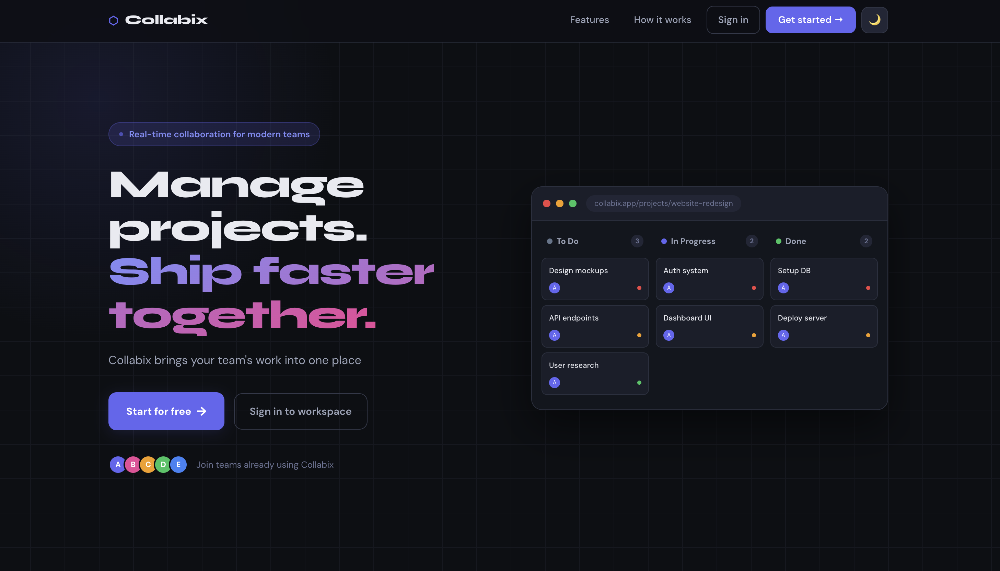
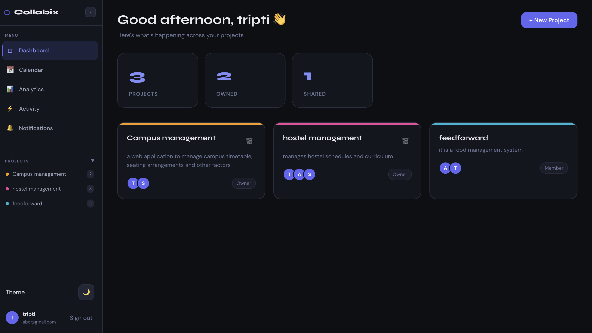
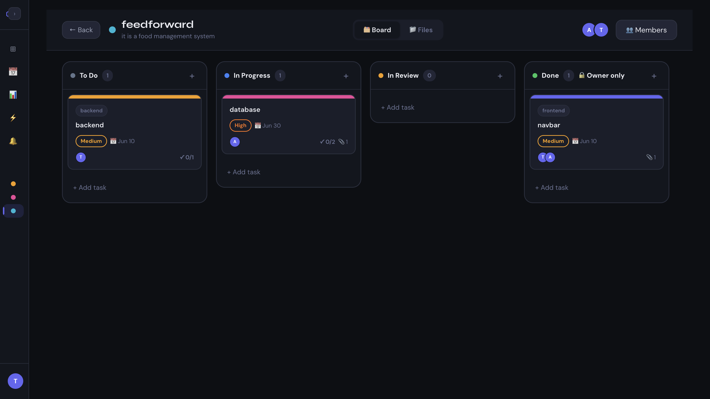
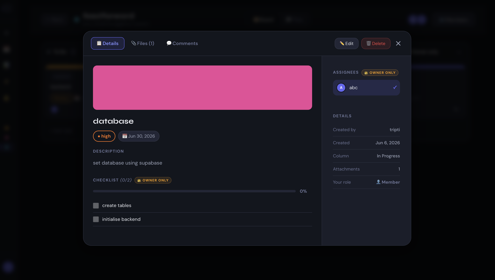
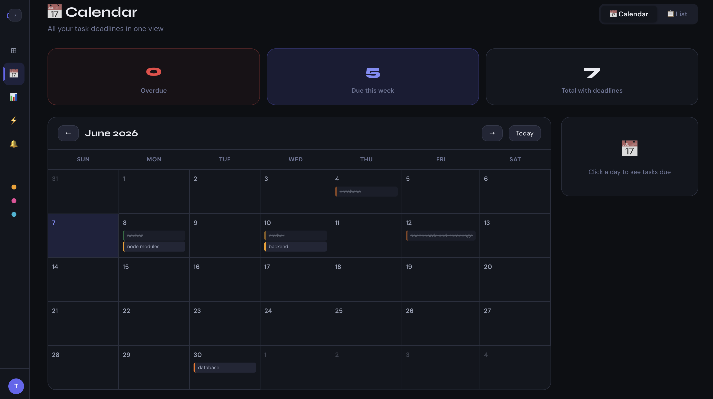
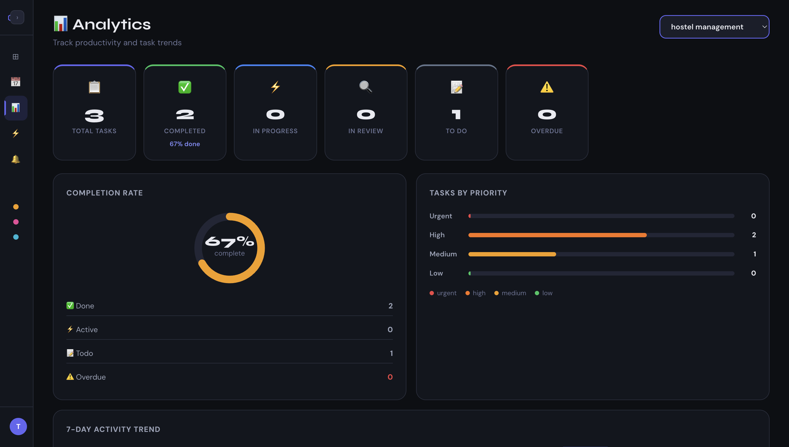

# ⬡ Collabix

**Real-time collaborative project management for modern teams**

---

## 📸 Screenshots

### Homepage & Dashboard

&nbsp;

 

### Board & Task detail

&nbsp;

 

### Calendar & Analytics

&nbsp;

---

## ✨ Features

### Project Management
- Create projects with custom colors, descriptions and due dates
- Invite teammates by name or email search

### Kanban Board
- **Drag & drop** tasks across To Do → In Progress → In Review → Done
- Real-time board updates for all members simultaneously — no refresh needed

### Tasks
- Title, description, priority (Low / Medium / High / Urgent), due dates, labels, cover colors
- Assign members, Checklist, File attachments

### Comments & @Mentions
- Real-time comments on every task via WebSockets
- Type **@name** to mention a teammate — they get notified instantly

### Notifications
- Real-time toast alerts for every action

### Analytics
- Per-project analytics dashboard with:
  - **Completion rate** ring chart
  - **Tasks by priority** bar chart
  - **7-day trend** — tasks created vs completed
  - **Team productivity** — tasks per member with completion rate

### Calendar
- Monthly calendar view with all task deadlines
- Overdue tasks highlighted in red

### Activity Feed
- Logs: task created, moved, completed, deleted, comments added, members added

### Themes
- **Dark**, **Black** and **Light** themes

### Security
- JWT authentication with 7-day expiry
- **Token blacklisting** via Redis on logout — old tokens can't be reused
- Passwords hashed with bcryptjs (12 rounds)
- CORS locked to production domain only

---

## 🛠 Tech Stack

### Frontend
| Technology | Role |
|---|---|
| React 19 | UI framework |
| React Router v7 | Client-side routing |
| Socket.io Client | Real-time WebSocket updates |
| react-beautiful-dnd | Drag & drop Kanban board |
| Axios | HTTP requests |
| date-fns | Date formatting |

### Backend
| Technology | Role |
|---|---|
| Node.js + Express | REST API server |
| Socket.io | WebSocket server |
| MongoDB + Mongoose | Primary database |
| Redis (Upstash) | Caching + token blacklist |
| JWT + bcryptjs | Auth & password security |
| Cloudinary + Multer | File upload & storage |

### Infrastructure
| Service | Role |
|---|---|
| MongoDB Atlas | Cloud database |
| Upstash Redis | Serverless Redis |
| Cloudinary | Media & file storage |
| Render | Backend hosting |
| Vercel | Frontend hosting |

---

## 🔄 Real-time Events

All changes sync instantly across all open browser sessions via Socket.io:

`task:created` · `task:updated` · `task:moved` · `task:deleted` · `project:updated` · `comment:added` · `comment:updated` · `comment:deleted` · `notification:new` · `activity:new`

---

## 📄 License

MIT © [Tripti Gupta](https://github.com/Tripti213)
